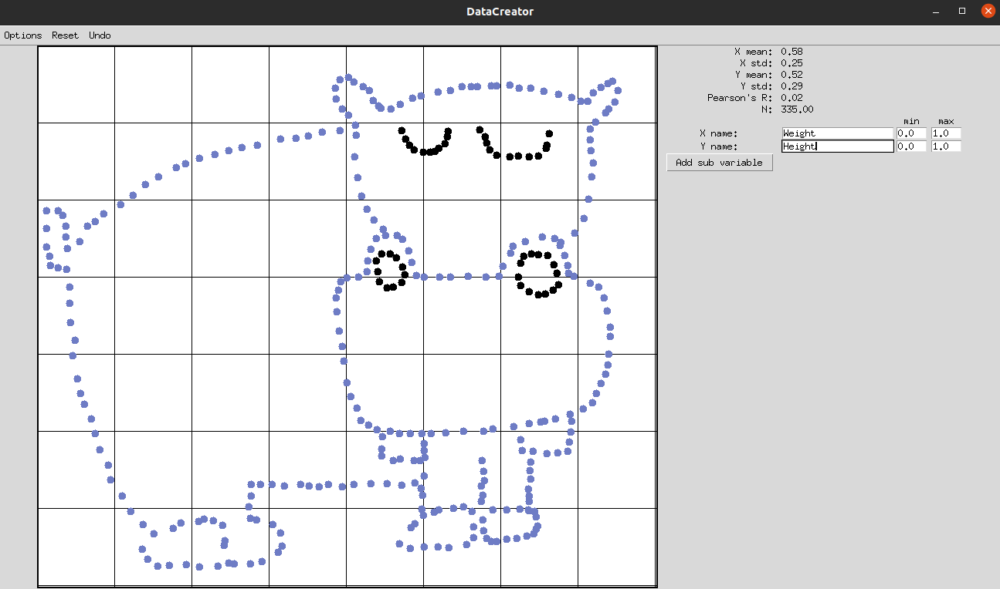
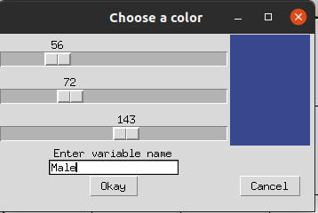

# Data Creator

This a project to aid with the creation of artificial datasets for learning purposes - probably.

The aim is to create the utility with as few additional modules as possible, and only use the core python utilities.

An example:



The image has a mean of 0.58 in the x-axis, and 0.52 in the Y with a correlation of 0.02. Currently the output is saved as a csv file.

### Usage:

Copy ```DataCreator.py```, ```drawing.py```, ```particle.py``` to you local directory or ```git clone https://github.com/Jake-Jasper/DataCreator```
```
import DataCreator

Datacreator.main()
```

Currently, the way to create sub variables, In the example above for example, is to click the "add sub variable button" which will give the following dialog.



In the example, the Blue colour is male and black Female.

You can also set the scale of the data in the x and y direction.


## Goals
For the upto date notes on what is currently being worked on [see here](https://github.com/Jake-Jasper/DataCreator/projects/1) 

- Make it a pip installable package
- Improve the implementation of secondary variables.
- Add the ability to load other datasets e.g. the iris dataset.
- Add option to enable/disable secondary variable. 

## Acknowledgements

Thankyou to [JimShapedCoding](https://www.youtube.com/channel/UCU8d7rcShA7MGuDyYH1aWGg) for reviewing the project in [this](https://www.youtube.com/watch?v=iywqBdTTAfM) video
